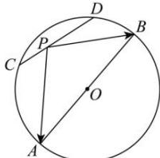

<!-- question-source:start -->
【14】（2023·福建高三校联考期中）如图，AB 是圆 O 的一条直径，且 $\left|AB\right|=4$ . C, D 是圆 O 上的任意两点， $\left|CD\right|=2$ . 点 P 在线段 CD 上，则 $\overrightarrow{PA} \cdot \overrightarrow{PB}$ 的取值范围是（）

A. $[-1,2]$ B. $[\sqrt{3},2]$ C. $[3,4]$ D. $[-1,0]$
<!-- question-source:end -->

![[Q00009352A1]]
