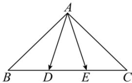

<!-- question-source:start -->
【24】(2023·浙江金华高二校考)如图,在等腰直角三角形 ABC 中, $AB = AC = \sqrt{2}$ , D, E 是线段 BC 上的点, 且 $DE = \frac{1}{3} BC$ .

(1) 若 $\overrightarrow{BD} = \frac{1}{3} \overrightarrow{BC}$ ，M 是 AB 边的中点，N 是 AC 边靠近 A 的四等分点，用向量 $\overrightarrow{AB}, \overrightarrow{AC}$ 表示 $\overrightarrow{DN}, \overrightarrow{EM}$ ；
（2）求 $\overrightarrow{AD}$ . $\overrightarrow{AE}$ 的取值范围.
<!-- question-source:end -->

![[Q00009362A1]]
