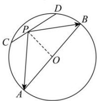

> [!faq]- 全练一本通解析
> **【答案】** D
>
> **【解析】**
> 解析:由题意知,连接 PO , O 为 AB 的中点,则 $\overrightarrow{PA}=\overrightarrow{PO}+\overrightarrow{OA},\overrightarrow{PB}=\overrightarrow{PO}+\overrightarrow{OB},\overrightarrow{OA}+\overrightarrow{OB}=\overline{0}$ 所以 $\overrightarrow{PA}\cdot\overrightarrow{PB}=(\overrightarrow{PO}+\overrightarrow{OA})\cdot(\overrightarrow{PO}+\overrightarrow{OB})=\overrightarrow{PO}^{2}+\overrightarrow{PO}\cdot(\overrightarrow{OA}+\overrightarrow{OB})+\overrightarrow{OA}\cdot\overrightarrow{OB}=$ $\overrightarrow{PO}^{2}-\overrightarrow{OA}^{2}=\left|\overrightarrow{PO}\right|^{2}-4$ 又 $\left|AB\right|=4,\left|CD\right|=2$ 所以圆心 O 到直线 CD 的距离为 $d=\sqrt{2^{2}-1^{2}}=\sqrt{3}$ 又点 P 在线段 CD 上，所以 $\sqrt{3}\leq\left|\overrightarrow{PO}\right|\leq2$ ，则 $3\leq\left|\overrightarrow{PO}\right|^{2}\leq4$ 所以 $-1\leq\left|\overrightarrow{PO}\right|^{2}-4\leq0$ ，即 $\overrightarrow{PA}\cdot\overrightarrow{PB}$ 的取值范围为 [-1,0]．故选：D.
> 
