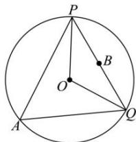

> [!faq]- 全练一本通解析
> **【答案】** A
>
> **【解析】**
> 解析: 因为弦 PQ 所对的圆心角为 $120^{\circ}$ ，且圆的半径为 2，
> 所以 $\left|PQ\right|=2\sqrt{3}$ 取 PQ 的中点 B，所以 $\left|BP\right|=\left|BQ\right|=\sqrt{3}$ ， $\left|BO\right|=1$ ，如图所示：
> 
> 因为 $\overrightarrow{AP}\cdot\overrightarrow{AQ}=\left(\overrightarrow{AB}+\overrightarrow{BP}\right)\cdot\left(\overrightarrow{AB}+\overrightarrow{BQ}\right)=\overrightarrow{AB}^{2}+\overrightarrow{AB}\cdot\left(\overrightarrow{BP}+\overrightarrow{BQ}\right)+\overrightarrow{BP}\cdot\overrightarrow{BQ}$ 因为 B 是 PQ 的中点，所以 $\overrightarrow{BP} + \overrightarrow{BQ} = \overline{0}$ ， $\overrightarrow{BP} \cdot \overrightarrow{BQ} = -\left|\overrightarrow{BP}\right|\left|\overrightarrow{BQ}\right|$ $\overrightarrow{AP} \cdot \overrightarrow{AQ} = \overrightarrow{AB}^{2} - \left|\overrightarrow{BP}\right|\left|\overrightarrow{BQ}\right| = \overrightarrow{AB}^{2} - 3$ 所以若 $\overrightarrow{AP} \cdot \overrightarrow{AQ}$ 最大，所以只需 $\left|\overrightarrow{AB}\right|$ 最大，
> 所以 $\left|\overrightarrow{AB}\right|_{\max} = \left|BO\right| + r = 1 + 2 = 3$ 所以 $\left(\overrightarrow{AP} \cdot \overrightarrow{AQ}\right)_{\max} = 3^{2} - 3 = 6$ 。
>
> 故选 **A**
