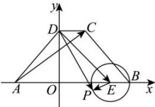

> [!faq]- 全练一本通解析
> **【答案】** C
>
> **【解析】**
> 解析：过点 D 作 $DO \perp AB$ ，垂足为 O，
> 以 O 为坐标原点，建立如图所示的平面直角坐标系，
> 则 $A(-2,0), C(1,2\sqrt{3}), D(0,2\sqrt{3}), E(2,0)$ 则 $\overrightarrow{DP} \cdot \overrightarrow{AC} = (\overrightarrow{DE} + \overrightarrow{EP}) \cdot \overrightarrow{AC} = \overrightarrow{DE} \cdot \overrightarrow{AC} + \overrightarrow{EP} \cdot \overrightarrow{AC}$ 其中 $\overrightarrow{DE} \cdot \overrightarrow{AC} = (2, -2\sqrt{3}) \cdot (3, 2\sqrt{3}) = 6 - 12 = -6$ $\overrightarrow{EP} \cdot \overrightarrow{AC} = \left|\overrightarrow{EP}\right|\left|\overrightarrow{AC}\right| \cos \overrightarrow{EP}, \overrightarrow{AC} = 1 \times \sqrt{9 + 12} \cos \overrightarrow{EP}, \overrightarrow{AC} = \sqrt{21} \cos \overrightarrow{EP}, \overrightarrow{AC}$ 当 $\cos \overrightarrow{EP}, \overrightarrow{AC} = 1$ ，即 $\overrightarrow{EP}, \overrightarrow{AC}$ 同向时， $\overrightarrow{EP} \cdot \overrightarrow{AC}$ 取最大值 $\sqrt{21}$ ，
> 所以 $\overrightarrow{DP} \cdot \overrightarrow{AC}$ 的最大值为 $\sqrt{21} - 6$ 。故选：C.
> 
