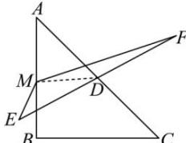

> [!faq]- 全练一本通解析
> **【答案】** C
>
> **【解析】**
> 解析: 连接 MD，
> 
> 则 $\overrightarrow{ME}\cdot\overrightarrow{MF}=(\overrightarrow{MD}+\overrightarrow{DE})\cdot(\overrightarrow{MD}+\overrightarrow{DF})$ $\overrightarrow{ME}\cdot\overrightarrow{MF}=(\overrightarrow{MD}+\overrightarrow{DE})\cdot(\overrightarrow{MD}+\overrightarrow{DF})=\overrightarrow{MD}^{2}-\overrightarrow{DE}^{2}$ 当 $MD\perp AB$ 时，MD 最小，可求得 $|MD|_{\min}=1$ ，
> 结合 $\overrightarrow{DE}^{2}=2$ ，得 $\overrightarrow{ME}\cdot\overrightarrow{MF}$ 的最小值为 -1，
>
> 故选 **C**.
