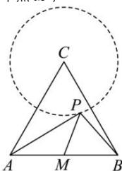

> [!faq]- 全练一本通解析
> **【答案】** $\left[3 - 2\sqrt{3},3 + 2\sqrt{3}\right]$
>
> **【解析】**
> 由已知,点 P 的轨迹是以 C 为圆心,1 为半径的圆.取线段 AB 的中点 M,
> 
> 则 $\overrightarrow{PA}\cdot\overrightarrow{PB}=\left(\overrightarrow{PM}+\overrightarrow{MA}\right)\cdot\left(\overrightarrow{PM}+\overrightarrow{MB}\right)=\left(\overrightarrow{PM}-\frac{1}{2}\overrightarrow{AB}\right)\cdot\left(\overrightarrow{PM}+\frac{1}{2}\overrightarrow{AB}\right)$ $=\left|\overrightarrow{PM}\right|^{2}-\frac{1}{4}\left|\overrightarrow{AB}\right|^{2}=|\overrightarrow{PM}|^{2}-1$ 又因为 $|PM|\in\left[|CM|-1,|CM|+1\right]$ ， $|CM|=\sqrt{3}$ ，所以 $|PM|\in\left[\sqrt{3}-1,\sqrt{3}+1\right]$ 则 $\overrightarrow{PA}\cdot\overrightarrow{PB}\in\left[3-2\sqrt{3},3+2\sqrt{3}\right]$ 。故答案为： $\left[3-2\sqrt{3},3+2\sqrt{3}\right]$ 。
