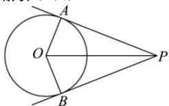

> [!faq]- 全练一本通解析
> **【答案】** C
>
> **【解析】**
> 解析·加图
> 
> 设 $|PO|=d$ ，则 $|PA|=|PB|=\sqrt{d^{2}-4}$ ，
> 因为 $\sin\angle APO=\frac{2}{d}$ 所以 $\cos\angle APB=1-2\left(\frac{2}{d}\right)^{2}=1-\frac{8}{d^{2}}$ 所以 $\overrightarrow{PA}\cdot\overrightarrow{PB}=(d^{2}-4)\left(1-\frac{8}{d^{2}}\right)=d^{2}+\frac{32}{d^{2}}-12\geq2\sqrt{32}-12=8\sqrt{2}-12$ 当且仅当 $d^{2}=\frac{32}{d^{2}}$ ，即 $d^{2}=4\sqrt{2}>4$ 时，等号成立，
> 故 $\overrightarrow{PA}\cdot\overrightarrow{PB}$ 的最小值为 $8\sqrt{2}-12$ ，
>
> 故选 **C**
