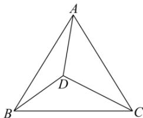

> [!faq]- 全练一本通解析
> **【答案】** $-\frac{88}{25}$
>
> **【解析】**
> 由题意,
> 
> $\overrightarrow{BD} = \frac{\overrightarrow{DC}}{2} +\overrightarrow{DA} = \frac{3}{2}\overrightarrow{DC} +\overrightarrow{CA}$ $\overrightarrow{BD} = \overrightarrow{BC} +\overrightarrow{CD}$ ，所以消去 $\overrightarrow{BD}$ 得 $\overrightarrow{CD} = \frac{2}{5} (\overrightarrow{CA} +\overrightarrow{CB})$ $\overrightarrow{DA}\cdot \overrightarrow{DB} = (\overrightarrow{DC} +\overrightarrow{CA})\cdot (\overrightarrow{DC} +\overrightarrow{CB}) = \left(\frac{3}{5}\overrightarrow{CA} -\frac{2}{5}\overrightarrow{CB}\right)\cdot \left(\frac{3}{5}\overrightarrow{CB} -\frac{2}{5}\overrightarrow{CA}\right)$ $= -\frac{6}{25}\left(a^2 +b^2\right) + \frac{13}{25} ab\cos 60^\circ$ 由 $\cos 60^{\circ} = \frac{a^{2} + b^{2} - 16}{2ab}$ ，得 $a^2 +b^2 = ab + 16\geq 2ab$ ，当且仅当 $a = b$ 时等号成立，
> ∴ $0 < ab\leq 16$ ∴原式 $= -\frac{6}{25}(16 + ab) + \frac{13}{50} ab = \frac{1}{50} ab - \frac{96}{25}\leq -\frac{88}{25}$ 故答案为： $-\frac{88}{25}$ .
