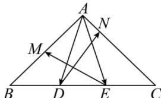

> [!faq]- 全练一本通解析
> **【答案】** （1） $\overline{DN} = -\frac{2}{3}\overline{AB} -\frac{1}{12}\overline{AC},\overline{EM} = \frac{1}{6}\overline{AB} -\frac{2}{3}\overline{AC};$ （2） $\left[\frac{8}{9},\frac{4}{3}\right]$
>
> **【解析】**
> （1）如图所示：
> 
> $\overrightarrow{DN}=\overrightarrow{CN}-\overrightarrow{CD}=\frac{3}{4}\overrightarrow{CA}+\overrightarrow{DC}=-\frac{3}{4}\overrightarrow{AC}+\frac{2}{3}\overrightarrow{BC}=-\frac{3}{4}\overrightarrow{AC}+\frac{2}{3}\left(\overrightarrow{AC}-\overrightarrow{AB}\right)$ $=-\frac{2}{3}\overrightarrow{AB}-\frac{1}{12}\overrightarrow{AC}$ $\overrightarrow{EM}=\overrightarrow{BM}-\overrightarrow{BE}=-\frac{1}{2}\overrightarrow{AB}-\frac{2}{3}\overrightarrow{BC}=-\frac{1}{2}\overrightarrow{AB}-\frac{2}{3}\left(\overrightarrow{AC}-\overrightarrow{AB}\right)=\frac{1}{6}\overrightarrow{AB}-\frac{2}{3}\overrightarrow{AC}$ （2）因为 $BC=\sqrt{2+2}=2$ 设 $\overrightarrow{BD}=\lambda\overrightarrow{BC},0\leq\lambda\leq\frac{2}{3}$ ，则 $\overrightarrow{BE}=\left(\lambda+\frac{1}{3}\right)\overrightarrow{BC}$ 所以 $\overrightarrow{AD}\cdot\overrightarrow{AE}=\left(\overrightarrow{AB}+\overrightarrow{BD}\right)\cdot\left(\overrightarrow{AB}+\overrightarrow{BE}\right)=\overrightarrow{AB}^{2}+\left(\overrightarrow{BD}+\overrightarrow{BE}\right)\cdot\overrightarrow{AB}+\overrightarrow{BD}\cdot\overrightarrow{BE}$ $=2+\left[\lambda\overrightarrow{BC}+\left(\lambda+\frac{1}{3}\right)\overrightarrow{BC}\right]\cdot\overrightarrow{AB}+\lambda\left(\lambda+\frac{1}{3}\right)\overrightarrow{BC}^{2}$ $=2+\left(2\lambda+\frac{1}{3}\right)\times2\times\sqrt{2}\times\cos\frac{3\pi}{4}+\lambda\left(\lambda+\frac{1}{3}\right)\times4=4\left(\lambda-\frac{1}{3}\right)^{2}+\frac{8}{9}$ $\because0\leq\lambda\leq\frac{2}{3}$ ，故 $\overrightarrow{AD}\cdot\overrightarrow{AE}$ 的取值范围是 $\left[\frac{8}{9},\frac{4}{3}\right]$ .
