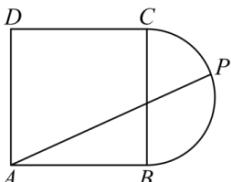

<!-- question-source:start -->
【27】(2023·湖北荆门高三校联考) 如图, ABCD 是边长 2 的正方形, P 为半圆弧 BC 上的动点 (含端点) 则 $\overrightarrow{AB} \cdot \overrightarrow{AP}$ 的取值范围为（）

A. $[2,6]$ B. $[2,3]$ C. $[4,6]$ D. $[4,8]$

第六节 专题: 求向量取值范围方法总结
<!-- question-source:end -->

![[Q00009365A1]]
