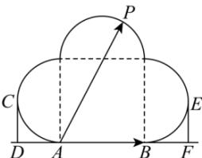

> [!faq]- 全练一本通解析
> **【答案】** B
>
> **【解析】**
> 解析:如图,作 CD⊥AB,EF⊥AB,垂足分别为 D,F,且 CD 与左半圆相切,切点为 C,EF 与右半圆相切,切点为 E.
> 
> $\overrightarrow{AB}\cdot\overrightarrow{AP}=|\overrightarrow{AB}|\cdot|\overrightarrow{AP}|\cos\langle\overrightarrow{AB},\overrightarrow{AP}\rangle$ ，其中 $|\overrightarrow{AP}|\cos\langle\overrightarrow{AB},\overrightarrow{AP}\rangle$ 为 $\overrightarrow{AP}$ 在 $\overrightarrow{AB}$ 上的投影，
> 因为 AB=4，所以 AD=BF=2。
> 当 P 与 E 重合时， $|\overrightarrow{AP}|\cos\langle\overrightarrow{AB},\overrightarrow{AP}\rangle$ 最大，最大值为 $4+2=6$ ，
> 此时 $\overrightarrow{AB}\cdot\overrightarrow{AP}$ 取得最大值，最大值为 $4\times6=24$ ；
> 当 P 与 C 重合时， $|\overrightarrow{AP}|\cos\langle\overrightarrow{AB},\overrightarrow{AP}\rangle$ 最小，最小值为 -2，
> 此时 $\overrightarrow{AB}\cdot\overrightarrow{AP}$ 取得最小值，最小值为 $4\times(-2)=-8$ ；
> 故 $\overrightarrow{AB}\cdot\overrightarrow{AP}$ 的取值范围是 $[-8,24]$ ，
>
> 故选 **B**
