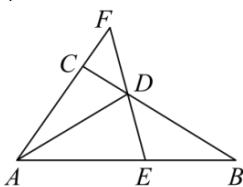

<!-- question-source:start -->
【42】如图所示, 在 $\triangle ABC$ 中, D 为 BC 边上一点, 且 $\overrightarrow{BD} = 2\overrightarrow{DC}$ , 过 D 的直线 EF 与直线 AB 相交于 E 点, 与直线 AC 相交于 F 点 (E, F 两点不重合). （1）用 $\overrightarrow{AB}$ , $\overrightarrow{AC}$ 表示 $\overrightarrow{AD}$ ;

（2）若 $\overrightarrow{AE} = \lambda \overrightarrow{AB}$ ， $\overrightarrow{AF} = \mu \overrightarrow{AC}$ ，求 $2\lambda + \mu$ 的最小值.

<!-- question-source:end -->

![[Q00009380A1]]
