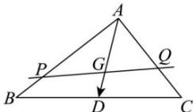

> [!faq]- 全练一本通解析
> **【答案】** \( \frac{4}{3} \)
>
> **【解析】**
> 如图所示, 设 BC 边上的中点为 D, 因为 G 是  \( \triangle ABC \)  的重心, 可得
> \( \overrightarrow{AG} = \frac{2}{3}\overrightarrow{AD} \) ,
> 根据向量的线性运算法则, 可得
> \( \overrightarrow{AG} = \frac{2}{3}\overrightarrow{AD} = \frac{2}{3} × \frac{1}{2} (\overrightarrow{AB} + \overrightarrow{AC}) = \frac{1}{3}\overrightarrow{AB} + \frac{1}{3}\overrightarrow{AC} \)
> 又因为 P, G, Q 三点共线, 可得  \( \overrightarrow{PG} = m\overrightarrow{PQ} \) , 即  \( \overrightarrow{AG} - \overrightarrow{AP} = m(\overrightarrow{AQ} - \overrightarrow{AP}) \) ,
> 可得  \( \overrightarrow{AG} = m\overrightarrow{AQ} + (1 - m)\overrightarrow{AP} \)
> 因为  \( \overrightarrow{AP} = \lambda\overrightarrow{AB},\overrightarrow{AQ} = \mu\overrightarrow{AC} \) ，可得  \( \frac{1}{3}\overrightarrow{AB} + \frac{1}{3}\overrightarrow{AC} = m\mu\overrightarrow{AC} + (1 - m)\lambda\overrightarrow{AB} \)
> 所以  \( \begin{cases}\text {m}\mu=\frac{1}{3}\\ (1-m)\lambda=\frac{1}{3}\end{cases} \) ，整理得  \( \lambda + \mu = 3\lambda\mu, 即\frac{1}{\lambda} + \frac{1}{\mu} = 3, 其中\frac{1}{2} ≤ \lambda, μ ≤ 1, \\ (1-m)\lambda=\frac{1}{3}\end{cases} \)
> 则  \( \lambda + \mu = \frac{1}{3} · (\frac{1}{\lambda} + \frac{1}{\mu})(\lambda + \mu) = \frac{1}{3} · (2 + \frac{\mu}{\lambda} + \frac{\lambda}{\mu}) ≥ \frac{1}{3} · (2 + 2\sqrt{\frac{\mu}{\lambda} ·\frac{\lambda}{\mu}}) = \frac{4}{3}, \\ 当且仅当  \( \frac{\mu}{\lambda} = \frac{\lambda}{\mu} 时, 即\lambda = \mu = \frac{2}{3} 时, 等号成立, 所以\lambda + μ 的最小值为\frac{4}{3}.
> 故答案为: $\frac{4}{3}$ .
> 
