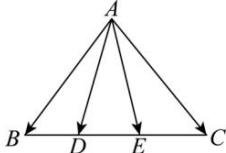

> [!faq]- 全练一本通解析
> **【答案】** 详见解析
>
> **【解析】**
> 解析:如图所示:
> 
> 不妨设 $\overrightarrow{CD} = \lambda \overrightarrow{CB}, (0 \leq \lambda \leq 1)$ ，则
> $$
> \overrightarrow {A D} = \overrightarrow {A C} + \overrightarrow {C D} = \overrightarrow {A C} + \lambda \overrightarrow {C B} = \overrightarrow {A C} + \lambda (\overrightarrow {C A} + \overrightarrow {A B}) = \lambda \overrightarrow {A B} + (1 - \lambda) \overrightarrow {A C},
> $$
> 同理设 $\overrightarrow{CE} = \mu \overrightarrow{CB}, (0 \leq \mu \leq 1)$ ，则
> $$
> \overrightarrow {A E} = \overrightarrow {A C} + \overrightarrow {C E} = \overrightarrow {A C} + \mu \overrightarrow {C B} = \overrightarrow {A C} + \mu (\overrightarrow {C A} + \overrightarrow {A B}) = \mu \overrightarrow {A B} + (1 - \mu) \overrightarrow {A C}
> $$
> 所以 $\overrightarrow{AD} +\overrightarrow{AE} = \left[\lambda \overrightarrow{AB} +\left(1 - \lambda\right)\overrightarrow{AC}\right] + \left[\mu \overrightarrow{AB} +\left(1 - \mu\right)\overrightarrow{AC}\right]$
> $$
> = (\lambda + \mu) \overrightarrow {A B} + (2 - \lambda - \mu) \overrightarrow {A C}
> $$
> 又由题意 $\overrightarrow{AD} + \overrightarrow{AE} = x\overrightarrow{AB} + \frac{y}{2}\overrightarrow{AC}$
> $$
> x = \lambda + \mu , \frac {y}{2} = 2 - \lambda - \mu , x + \frac {y}{2} = (\lambda + \mu) + (2 - \lambda - \mu) = 2,
> $$
> $$
> 0 \leq x \leq 2, 0 \leq y \leq 4
> $$
> 从而 $\frac{x}{2} +\frac{y}{4} = 1,0\leq x\leq 2,0\leq y\leq 4$
> $$
> x \neq 0, y \neq 0
> $$
> $$
> \frac {1}{x} + \frac {2}{y} = \left(\frac {x}{2} + \frac {y}{4}\right) \left(\frac {1}{x} + \frac {2}{y}\right) = 1 + \frac {y}{4 x} + \frac {x}{y} \geq 1 + 2 \sqrt {\frac {y}{4 x} \cdot \frac {x}{y}} = 2
> $$
> $$
> x = 1, y = 2
> $$
> $$
> \frac {1}{x} + \frac {2}{y}
> $$
> $$
> \overrightarrow {A D} = \frac {1}{3} \overrightarrow {A B} + \frac {2}{3} \overrightarrow {A C}; (2) \frac {8}{3}
> $$
> $$
> \overrightarrow {B D} = 2 \overrightarrow {D C}
> $$
> $$
> \overrightarrow {A D} - \overrightarrow {A B} = 2 \overrightarrow {A C} - 2 \overrightarrow {A D}
> $$
> $$
> \overrightarrow {A D} = \frac {1}{3} \overrightarrow {A B} + \frac {2}{3} \overrightarrow {A C}
> $$
> $$
> \overrightarrow {A E} = \lambda \overrightarrow {A B}, \overrightarrow {A F} = \mu \overrightarrow {A C}, \overrightarrow {A D} = \frac {1}{3} \overrightarrow {A B} + \frac {2}{3} \overrightarrow {A C}
> $$
> $$
> \overrightarrow {A D} = \frac {1}{3 \lambda} \overrightarrow {A E} + \frac {2}{3 \mu} \overrightarrow {A F}
> $$
> $$
> \lambda > 0, \mu > 0
> $$
> $$
> \frac {1}{3 \lambda} + \frac {2}{3 \mu} = 1
> $$
> $$
> 2 \lambda + \mu = (2 \lambda + \mu) \cdot \left(\frac {1}{3 \lambda} + \frac {2}{3 \mu}\right) = \frac {4}{3} + \frac {\mu}{3 \lambda} + \frac {4 \lambda}{3 \mu} \geq \frac {4}{3} + 2 \sqrt {\frac {\mu}{3 \lambda} \cdot \frac {4 \lambda}{3 \mu}} = \frac {8}{3}
> $$
> $$
> \frac {\mu}{3 \lambda} = \frac {4 \lambda}{3 \mu}
> $$
> $$
> 2 \lambda + \mu
> $$
> $$
> \mu = 2 \lambda = \frac {4}{3}
> $$
> $$
> \begin{array}{c} \frac {8}{3} \end{array}
> $$
