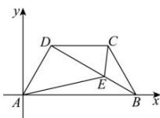

> [!faq]- 全练一本通解析
> **【答案】** A
>
> **【解析】**
> 解析: 如图, 以 A 为原点, AB 所在直线为 x 轴, 过 A 且与 AB 垂直的直线为 y 轴建立平面直角坐标系, 则 $A(0,0)$ , $D(1,\sqrt{3})$ , $C(3,\sqrt{3})$ , $B(4,0)$ , 所以 $\overline{BD} = (-3,\sqrt{3})$ .
> 
> 设 $E(x,y)$ ， $\overline{BE} = \lambda \overline{BD}$ ， $\lambda \in [0,1]$ ，（注意判断 $\lambda$ 的取值范围，为后续计算做准备）
> 则 $(x - 4,y) = \lambda (-3,\sqrt{3})$ ，所以 $\left\{ \begin{array}{l}x - 4 = -3\lambda \\ y = \sqrt{3}\lambda \end{array} \right.$ ，得 $\left\{ \begin{array}{l}x = 4 - 3\lambda \\ y = \sqrt{3}\lambda \end{array} \right.$ 所以 $E(4 - 3\lambda ,\sqrt{3}\lambda)$ ，所以 $\overline{AE} = (4 - 3\lambda ,\sqrt{3}\lambda)$ ， $\overline{CE} = (1 - 3\lambda ,\sqrt{3}\lambda -\sqrt{3})$ 所以 $\overline{AE}\cdot \overline{CE} = (4 - 3\lambda)(1 - 3\lambda) + \sqrt{3}\lambda (\sqrt{3}\lambda -\sqrt{3})\\ = 12\lambda^2 -18\lambda +4 = 12\times \left(\lambda -\frac{3}{4}\right)^2 -\frac{11}{4},$ 所以当 $\lambda = \frac{3}{4}$ 时， $\overline{AE}\cdot \overline{CE}$ 取得最小值，为 $-\frac{11}{4}$ .
>
> 故选 **A**
