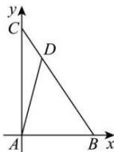

> [!faq]- 全练一本通解析
> **【答案】** $[-4,9]$
>
> **【解析】**
> 以 A 为坐标原点, $\overrightarrow{AB}, \overrightarrow{AC}$ 正方向为 x, y 轴正方向, 可建立如图所示平面直角坐标系,
> 
> 则 $A(0,0), B(2,0), C(0,3), \therefore \overrightarrow{BC} = (-2,3), \overrightarrow{AB} = (2,0)$ 设 $\overrightarrow{BD} = \lambda \overrightarrow{BC}(0 \leq \lambda \leq 1)$ ，则 $\overrightarrow{BD} = (-2\lambda, 3\lambda), \therefore \overrightarrow{AD} = \overrightarrow{AB} + \overrightarrow{BD} = (2 - 2\lambda, 3\lambda), \therefore \overrightarrow{AD} \cdot \overrightarrow{BC} = -2(2 - 2\lambda) + 9\lambda = 13\lambda - 4$ ，又 $0 \leqslant \lambda \leqslant 1$ ， $\therefore -4 \leqslant \overrightarrow{AD} \cdot \overrightarrow{BC} \leqslant 9$ ，即 $\overrightarrow{AD} \cdot \overrightarrow{BC}$ 的取值范围为 $[-4,9]$ . 故答案为： $[-4,9]$ .
