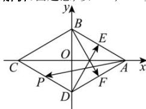

> [!faq]- 全练一本通解析
> **【答案】** 1; $-\frac{3}{2}$
>
> **【解析】**
> 由题意,以 AC, BD 交点 O 为原点建立如图直角坐标系,
> 
> 因为菱形边长为 2， $\angle BAD=60^{\circ}$ ，所以 $A\left(\sqrt{3},0\right)$ ， $B(0,1)$ ， $C\left(-\sqrt{3},0\right)$ ， $D(0,-1)$ ，
> 因为 P 为 CD 的中点，所以 $P\left(-\frac{\sqrt{3}}{2},-\frac{1}{2}\right)$ ，
> 所以 $\overrightarrow{AP}=\left(-\frac{3\sqrt{3}}{2},-\frac{1}{2}\right)$ ， $\overrightarrow{BD}=(0,-2)$ ，
> 所以 $\overrightarrow{AP}\cdot\overrightarrow{BD}=-\frac{3\sqrt{3}}{2}\times0+\frac{1}{2}\times2=1$ 因为 $\overrightarrow{AB}=\left(-\sqrt{3},1\right)$ ， $\overrightarrow{AD}=\left(-\sqrt{3},-1\right)$ ，
> 又 $\overrightarrow{AE}=\lambda\overrightarrow{AB}$ ， $\overrightarrow{AF}=\left(1-\lambda\right)\overrightarrow{AD}$ ， $0\leqslant\lambda\leqslant1$ 所以 $\overrightarrow{DE}=\overrightarrow{AE}-\overrightarrow{AD}=\lambda\overrightarrow{AB}-\overrightarrow{AD}=\lambda(-\sqrt{3},1)-(-\sqrt{3},-1)=\left(\sqrt{3}-\sqrt{3}\lambda,1+\lambda\right)$ ， $\overrightarrow{BF}=\overrightarrow{AF}-\overrightarrow{AB}=(1-\lambda)\overrightarrow{AD}-\overrightarrow{AB}=(1-\lambda)(-\sqrt{3},-1)-(-\sqrt{3},1)=(\sqrt{3}\lambda,\lambda-2)$ ，
> 所以 $\overrightarrow{DE}\cdot\overrightarrow{BF}=\sqrt{3}\lambda\left(\sqrt{3}-\sqrt{3}\lambda\right)+\left(1+\lambda\right)\left(\lambda-2\right)=-2\lambda^{2}+2\lambda-2=-2\left(\lambda-\frac{1}{2}\right)^{2}-\frac{3}{2}$ 因为 $0 \leqslant \lambda \leqslant 1$ ，所以当 $\lambda = \frac{1}{2}$ 时， $\overrightarrow{DE} \cdot \overrightarrow{BF}$ 取到最大值为 $-\frac{3}{2}$ .
> 故答案为： $1; -\frac{3}{2}$
