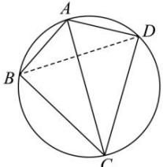

> [!faq]- 全练一本通解析
> **【答案】** （1） $\frac{7\sqrt{3}}{3}$ （2）8
>
> **【解析】**
> （1）解:如图,在圆 O 中,连接 BD ,
> 
> $$
> \triangle A B D
> $$
> 得： $BD^{2}=AB^{2}+AD^{2}-2AB\cdot AD\cdot\cos120^{\circ}=9+25-2\times3\times5\times\left(-\frac{1}{2}\right)=49$ 所以 BD=7，设圆 O 半径为 R，由正弦定理得：
> ∴ $2R=\frac{BD}{\sin120^{\circ}}=\frac{7}{\frac{\sqrt{3}}{2}}=\frac{14\sqrt{3}}{3}$ ，所以半径 $R=\frac{7\sqrt{3}}{3}$ ;
> （2）解：由余弦定理得 $\cos\angle ADB=\frac{AD^{2}+BD^{2}-AB^{2}}{2AD\cdot BD}=\frac{25+49-9}{2\times5\times7}=\frac{13}{14}$ ，
> 由于 $\angle ADB\in(0,\pi)$ ，所以 $\sin\angle ADB=\sqrt{1-\cos^{2}\angle ADB}=\frac{3\sqrt{3}}{14}$ ，
> 因为 AC 平分 $\angle BAD$ ，所以 $\angle BDC = \angle BAC = \frac{1}{2} \angle BAD = 60^{\circ}$ ，
> 所以 $\sin\angle ADC = \sin(\angle ADB + 60^{\circ}) = \sin\angle ADB \cdot \cos 60^{\circ} + \cos\angle ADB \cdot \sin 60^{\circ}$ $=\frac{3\sqrt{3}}{14}\times\frac{1}{2}+\frac{13}{14}\times\frac{\sqrt{3}}{2}=\frac{4\sqrt{3}}{7}$ 由正弦定理得 $\frac{AC}{\sin\angle ADC}=2R=\frac{14\sqrt{3}}{3}\Rightarrow AC=\frac{14\sqrt{3}}{3}\times\frac{4\sqrt{3}}{7}=8$
