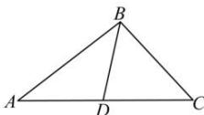

> [!faq]- 全练一本通解析
> **【答案】** （1） $B = \frac{2\pi}{3}$ ；（2） $4\sqrt{3}$
>
> **【解析】**
> （1）由题意，在 $\triangle ABC$ 中，
> 由正弦定理得， $2\sin B\cos C=2\sin A+\sin C$
> $\because \sin A = \sin \left[\pi - (B + C)\right] = \sin (B + C) = \sin B \cos C + \cos B \sin C,$ $\therefore$ 代入上式可得 $2\cos B\sin C + \sin C = 0$ $\because C \in (0, \pi),$ $\therefore \sin C \neq 0,$ $\therefore \cos B = -\frac{1}{2},$ $\because B \in (0, \pi),$ $\therefore B = \frac{2\pi}{3}$
> (2) 由题意及 (1) 得,
> 在 $\triangle ABC$ 中， $D$ 为线段 $AC$ 的中点， $b = 4\sqrt{3}$ ， $BD = 2$
> 
> $$
> \overrightarrow {B D} = \frac {1}{2} (\overrightarrow {B A} + \overrightarrow {B C}), \overrightarrow {B D} ^ {2} = \frac {1}{4} (\overrightarrow {B A} + \overrightarrow {B C}) ^ {2} = \frac {1}{4} (\overrightarrow {B A} ^ {2} + 2 \overrightarrow {B A} \cdot \overrightarrow {B C} + \overrightarrow {B C} ^ {2})
> $$
> 即 $4=\frac{1}{4}\left(c^{2}+2ac\cos\frac{2\pi}{3}+a^{2}\right)$
> 整理得， $a^2 + c^2 - ac = 16$
> 由余弦定理得， $b^{2}=a^{2}+c^{2}-2ac\cos\frac{2\pi}{3}$ ，即 $a^{2}+c^{2}+ac=48$ ，
> 联立 $\left\{ \begin{array}{l}a^2 +c^2 -ac = 16\\ a^2 +c^2 +ac = 48 \end{array} \right.$ ，解得： $ac = 16$
> $$
> S _ {\triangle A B C} = \frac {1}{2} a c \sin \frac {2 \pi}{3} = \frac {1}{2} \times 1 6 \times \frac {\sqrt {3}}{2} = 4 \sqrt {3}
> $$
