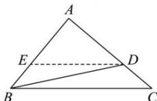

> [!faq]- 全练一本通解析
> **【答案】** （1）证明见解析；（2） $\frac{7}{12}$
>
> **【解析】**
> (1)证明: 因为 $\sin^2\angle ABC = \sin A \cdot \sin C$ , 所以由正弦定理得 $b^2 = ac$ 因为 $BD \cdot \sin \angle ABC = BC \cdot \sin C$ , 所以由正弦定理得, $BD \cdot b = ac$ ,
> 所以 $BD \cdot b = b^2$ , 又 $b > 0$ , 所以 $BD = b$ . 即为 $BD = AC$
> (2) 如图所示,
> 
> 过点 D 作 DE // BC 交 AB 于点 E，
> 设 $\overrightarrow{AD} = \lambda \overrightarrow{AC}$ ，则 $\overrightarrow{BD} = \overrightarrow{BA} + \overrightarrow{AD} = \overrightarrow{BA} + \lambda \overrightarrow{AC} = \overrightarrow{BA} + \lambda (\overrightarrow{BC} - \overrightarrow{BA}) = (1 - \lambda) \overrightarrow{BA} + \lambda \overrightarrow{BC}$ 因为 $\overline{BD} = \frac{1}{3} \overline{BA} + \frac{2}{3} \overline{BC}$ ，所以 $\left\{\begin{aligned}&1 - \lambda = \frac{1}{3}\\ &\lambda = \frac{2}{3}\end{aligned}\right.$ ，即 $\lambda = \frac{2}{3}$ ，则 AD = 2DC，
> 所以 $\frac{AE}{EB} = \frac{AD}{DC} = 2, \frac{DE}{BC} = \frac{2}{3}$ ，所以 $BE = \frac{c}{3}, DE = \frac{2}{3} a$ 。
> 在 $\triangle BDE$ 中， $\cos \angle BED = \frac{BE^{2} + DE^{2} - BD^{2}}{2BE \cdot DE} = \frac{\frac{c^{2}}{9} + \frac{4a^{2}}{9} - b^{2}}{2 \times \frac{c}{3} \times \frac{2a}{3}} = \frac{c^{2} + 4a^{2} - 9b^{2}}{4ac} = \frac{c^{2} + 4a^{2} - 9ac}{4ac}$ ，
> 在 $\triangle ABC$ 中， $\cos \angle ABC = \frac{AB^{2} + BC^{2} - AC^{2}}{2AB \cdot BC} = \frac{c^{2} + a^{2} - b^{2}}{2ac} = \frac{c^{2} + a^{2} - ac}{2ac}$ 。
> 因为 $\angle BED = \pi - \angle ABC$ ，所以 $\cos \angle BED = -\cos \angle ABC$ ，所以 $\frac{c^{2} + 4a^{2} - 9ac}{4ac} = -\frac{c^{2} + a^{2} - ac}{2ac}$ ，
> 化简得 $3c^{2} + 6a^{2} - 11ac = 0$ ，方程两边同时除以 $a^{2}$ ，得 $3\left(\frac{c}{a}\right)^{2} - 11\left(\frac{c}{a}\right) + 6 = 0$ ，
> 解得 $\frac{c}{a} = \frac{2}{3}$ 或 $\frac{c}{a} = 3$ 。
> 当 $\frac{c}{a} = \frac{2}{3}$ ，即 $c = \frac{2}{3} a$ 时， $\cos \angle ABC = \frac{c^{2} + a^{2} - ac}{2ac} = \frac{\frac{4}{9} a^{2} + a^{2} - \frac{2}{3} a^{2}}{\frac{4}{3} a^{2}} = \frac{7}{12}$ ；
> 当 $\frac{c}{a} = 3$ ，即 c = 3a 时， $\cos \angle ABC = \frac{c^{2} + a^{2} - ac}{2ac} = \frac{9a^{2} + a^{2} - 3a^{2}}{6a^{2}} = \frac{7}{6} > 1$ （舍去）。综上， $\cos \angle ABC = \frac{7}{12}$ 。
