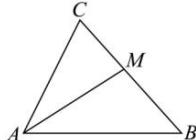

> [!faq]- 全练一本通解析
> **【答案】** （1） $A = \frac{\pi}{3}$ ；（2） $b + c = 8$
>
> **【解析】**
> （1）由 $2a\sin A + c\sin B + b\sin C = 2b\sin B + 2c\sin C$ 及正弦定理得： $2a^2 + cb + bc = 2b^2 + 2c^2$ ，即 $b^2 + c^2 - a^2 = bc$ 。由余弦定理得 $\cos A = \frac{b^2 + c^2 - a^2}{2bc} = \frac{1}{2}$ ，又 $0 < A < \pi$ ，所以 $A = \frac{\pi}{3}$ 。（2）由角 $A$ 的内角平分线交 $BC$ 于点 $M$ 可知 $\angle BAM = \angle CAM = \frac{\pi}{6}$ ，
> $S_{\triangle ABC} = S_{\triangle ABM} + S_{\triangle ACM} = \frac{1}{2} AM\cdot c\sin \angle BAM + \frac{1}{2} AM\cdot b\sin \angle CAM$ $= \frac{1}{2}\times 3\sqrt{3} c\sin \angle BAM + \frac{1}{2}\times 3\sqrt{3} b\sin \angle CAM = \frac{3\sqrt{3}}{4} (b + c) = 6\sqrt{3}$ 所以 $b + c = 8$
> 
