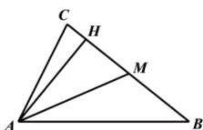

> [!faq]- 全练一本通解析
> **【答案】** （1） $A = \frac{\pi}{3}$ ；（2） $2\sqrt{3}$ .
>
> **【解析】**
> （1） $\because 1 + \frac{\tan A}{\tan B} = 1 + \frac{\sin A \cos B}{\cos A \sin B} = \frac{\cos A \sin B + \sin A \cos B}{\cos A \sin B} = \frac{\sin(A + B)}{\cos A \sin B} = \frac{2c}{b}$ , $\therefore$ 由正弦定理得： $\frac{\sin(A + B)}{\cos A \sin B} = \frac{2\sin C}{\sin B}$ , $\because A + B + C = \pi$ ， $\therefore \sin(A + B) = \sin C$ ，又 $C \in (0, \pi)$ ， $\therefore \sin C \neq 0$ ， $\therefore \cos A = \frac{1}{2}$ ，又 $A \in (0, \pi)$ ， $\therefore A = \frac{\pi}{3}$ ;
> （2）如图所示，
> 
> ∵ M 是 BC 中点，∴ $\overrightarrow{AM} = \frac{1}{2} (\overrightarrow{AB} + \overrightarrow{AC})$ , $\therefore\left|\overrightarrow{AM}\right|^{2}=\frac{1}{4}\left(\overrightarrow{AB}+\overrightarrow{AC}\right)^{2}=\frac{1}{4}\left|\overrightarrow{AB}\right|^{2}+\frac{1}{2}\overrightarrow{AB}\cdot\overrightarrow{AC}+\frac{1}{4}\left|\overrightarrow{AC}\right|^{2}$ $=\frac{1}{4}\left(\left|\overrightarrow{AB}\right|^{2}+\left|\overrightarrow{AB}\right|\cdot\left|\overrightarrow{AC}\right|+\left|\overrightarrow{AC}\right|^{2}\right)$ , $\therefore c^{2}+bc+b^{2}=32\ldots①;$ $\because S_{\triangle ABC}=\frac{1}{2}BC\cdot AH=\frac{1}{2}AB\cdot AC\sin A,\therefore\frac{\sqrt{3}}{2}bc=\sqrt{3}a,$ 即 bc=2a …②;
> 根据余弦定理得： $a^{2}=b^{2}+c^{2}-2bc\cos A=b^{2}+c^{2}-bc\ldots③,$ 由①②③得： $\left(\frac{bc}{2}\right)^{2}=32-2bc$ ，解得：bc=8， $\therefore S_{\triangle ABC}=\frac{1}{2}bc\sin A=\frac{1}{2}\times8\times\frac{\sqrt{3}}{2}=2\sqrt{3}.$
