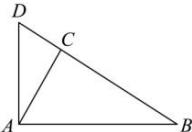

> [!faq]- 全练一本通解析
> **【答案】** （1） $A=\frac{\pi}{3}$ （2） $3+3\sqrt{3}$
>
> **【解析】**
> （1）因为 $c(5\cos A - \cos 2A)\sin B = 3b\sin C$ 由正弦定理得 $bc(5\cos A - \cos 2A)=3bc$ ．两边除以 bc，
> 得 $5\cos A - \cos 2A = 3$ 由二倍角公式，有 $5\cos A - (2\cos^{2}A - 1) = 3$ 整理为 $2\cos^{2}A - 5\cos A + 2 = 0$ 上式因式分解为 $(2\cos A - 1)(\cos A - 2) = 0$
> 解得 $\cos A=\frac{1}{2}$ 或 $\cos A=2$ （舍去），
> 又由 $0 < A < \pi$ ，可得 $A = \frac{\pi}{3}$
> (2) 由 $AB \perp AD$ 。有 $\angle CAD = \frac{\pi}{6}$
> 又由 $BC = 3CD$ ，可得 $S_{\triangle ABC} = 3S_{\triangle ACD}$ ，有
> $\frac{1}{2}AB\times AC\sin\frac{\pi}{3}=3\times\frac{1}{2}AD\times AC\sin\frac{\pi}{6}$ ，可得 $AB=\sqrt{3}AD$ ，
> 又由 $\triangle ABD$ 的面积为 $2\sqrt{3}$ 及 $\angle BAD = \frac{\pi}{2}$ ，有 $\frac{1}{2} AB \times AD = 2\sqrt{3}$ ，
> 代入 $AB = \sqrt{3} AD$ ，可得 $AD = 2$ ， $AB = 2\sqrt{3}$
> 又由 $S_{\triangle ABC} = \frac{3}{4} S_{\triangle ABD}$ ，有 $\frac{1}{2} AB\times AC\sin \frac{\pi}{3} = \frac{3}{4}\times 2\sqrt{3}$ ，代入 $AB = 2\sqrt{3}$ ，可得 $AC = \sqrt{3}$
> 在 $\triangle ABC$ 中, 由余弦定理, 有
> $$
> B C = \sqrt {A B ^ {2} + A C ^ {2} - A B \times A C} = \sqrt {1 2 + 3 - 2 \sqrt {3} \times \sqrt {3}} = 3
> $$
> 
> 有 $\triangle ABC$ 的周长为 $2\sqrt{3} +\sqrt{3} +3 = 3 + 3\sqrt{3}$
