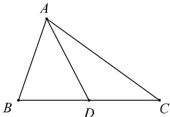
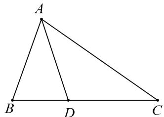
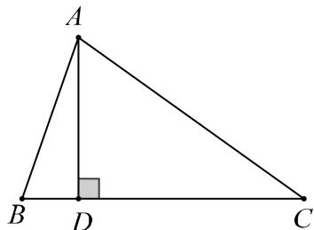

知识导学

1. 中线处理方法

如图, $\triangle ABC$ 中, AD 为 BC 的中线, 已知 AB, AC, 及 $\angle A$ , 求中线 AD 长.

① 向量法: $\overrightarrow{AD} = \frac{1}{2}\left(\overrightarrow{AB} + \overrightarrow{AC}\right)$ , 平方即可;

② 余弦定理:邻补角余弦值为相反数, 即 $\cos\angle ADB + \cos\angle ADC = 0$ .

注:若或将条件 “AD 为 BC 的中线” 换为 “ $\frac{BD}{CD}=\lambda$ ” 则可以考虑方法①或方法②.

2. 角分线处理方法

如图, $\triangle ABC$ 中, AD 平分 $\angle BAC$ .

①角平分线定理: $\frac{AB}{AC} = \frac{BD}{CD}$

②等面积法

$$
S _ {\triangle A B C} = S _ {\triangle A B D} + S _ {\triangle A D C} \Rightarrow \frac {1}{2} A B \times A C \times \sin A = \frac {1}{2} A B \times A D \times \sin \frac {A}{2} + \frac {1}{2} A C \times A D \times \sin \frac {A}{2}
$$

3. 高线处理方法

如图, $\triangle ABC$ 中, AD 为 $\triangle ABC$ 的高线.

①等面积法: $AD \cdot BC = AB \cdot AC \cdot \sin \angle BAC$

② $AD = AB \cdot \sin \angle ABD = AC \cdot \sin \angle ACD$

③射影定理: $a = c \cdot \cos B + b \cdot \cos C$
