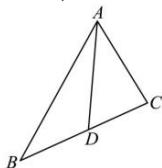

> [!faq]- 全练一本通解析
> **【答案】** （1） $A = \frac{\pi}{3}$ ；（2） $\sqrt{6}$
>
> **【解析】**
> （1） $(a - b)(\sin A + \sin B) = (c - b)\sin (A + B)$ ，因为△ABC中 $A + B = \pi - C$ ，所以 $(a - b)(\sin A + \sin B) = (c - b)\sin C$ ，由正弦定理可得 $(a - b)(a + b) = (c - b)c$ ，即 $b^2 + c^2 - a^2 = bc$ ， $\cos A = \frac{b^2 + c^2 - a^2}{2bc} = \frac{1}{2}$ ，又 $A \in (0, \pi)$ ，所以 $A = \frac{\pi}{3}$ .
> （2）由（1）知， $A = \frac{\pi}{3}$ ，△ABC的面积为 $2\sqrt{3}$ ，所以 $\frac{1}{2} bc\sin \frac{\pi}{3} = 2\sqrt{3}$ ，解得 $bc = 8$ ，
> 
> 由平面向量可知 $\overrightarrow{AD}=\frac{1}{2}\left(\overrightarrow{AB}+\overrightarrow{AC}\right)$ ,
> 所以 $\overrightarrow{AD}^{2}=\frac{1}{4}\left(\overrightarrow{AB}+\overrightarrow{AC}\right)^{2}=\frac{1}{4}\left(\overrightarrow{AB}^{2}+\overrightarrow{AC}^{2}+2\overrightarrow{AB}\cdot\overrightarrow{AC}\right)$ $=\frac{1}{4}\left(b^{2}+c^{2}+2bc\cos\frac{\pi}{3}\right)=\frac{1}{4}\left(b^{2}+c^{2}+bc\right)\geq\frac{1}{4}\left(2bc+bc\right)=\frac{3}{4}bc=6$ 当且仅当 $b=c=2\sqrt{2}$ 时取等号，故 BC 边中线 AD 的最小值为 $\sqrt{6}$ .
