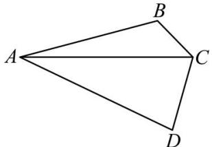

<!-- question-source:start -->
【4】如图, 四边形 ABCD 中, $\angle B = \frac{2}{3}\pi$ .

（1）若 $AB = 3$ ， $AC = \sqrt{13}$ ，求 $\triangle ABC$ 的面积；

（2）若 $CD = \sqrt{3}BC$ ， $\angle CAD = \frac{\pi}{6}$ ， $\angle BCD = \frac{2\pi}{3}$ ，记 $\angle BAC$ 为 $\theta$ ，求 $\theta$ 的值.

<!-- question-source:end -->

![[Q00005302A1]]
