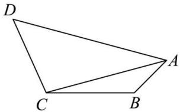

<!-- question-source:start -->
【9】（2023·山东滨州高三校考练习）如图，在平面四边形ABCD中， $\angle ABC=\frac{3\pi}{4}$ ， $\angle BAC=\angle DAC$ ， $\angle ADC = \frac{\pi}{6}, CD = 2AB = 4$ , 求 AC,

<!-- question-source:end -->

![[Q00005306A1]]
