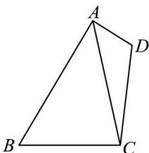

<!-- question-source:start -->
【11】（2023·安徽高三校联考）如图，平面四边形ABCD的对角线分别为AC，BD，其中 $AB=\sqrt{2}$ ， $BC\perp CD,\angle BCD=\frac{2}{3}\angle ABC$ 。
（1）若 BC=2, $S_{\triangle ACD}=\frac{3\sqrt{14}}{2}$ ，求 $\triangle BCD$ 的面积；
(2) 若 $\angle ADC = \frac{1}{3} \angle BCD, AD = 2AB$ ，求 $\cos \angle ACD$ 的值.

$$
A B C D
$$

$$
B + D = \pi , A B = 3, D A = 1, B C = C D
$$

$$
A C = \sqrt {7}
$$

$$
P C = \sqrt {3}
$$

<!-- question-source:end -->

![[Q00005308A1]]
