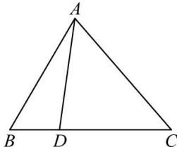
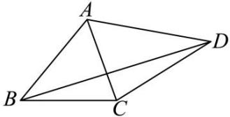

<!-- question-source:start -->
【7】（2023·全国·模拟预测）如图，在平面四边形ABCD中， $\angle BCD=150^{\circ}$ ， $CD=2\sqrt{3}$ ， $BD=\sqrt{39}$ 。

(1) 求 $\triangle BCD$ 的面积;

(2) 若 $\angle BAC = \angle CAD = 60^{\circ}$ ，求 AC。
<!-- question-source:end -->

![[Q00009652A1]]
