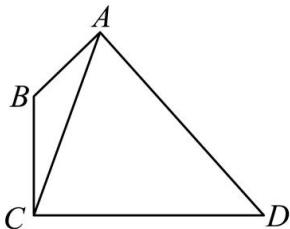
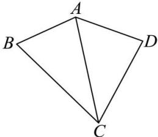

<!-- question-source:start -->
【15】（2023·山东日照校联考模拟预测）如图，在凸四边形ABCD中， $AB = AD = \sqrt{7}, \angle BAD = \frac{2\pi}{3}$ ，
（1）若 $AC = 2\sqrt{7}, \cos \angle BAC = \frac{1}{7}$ ，求 CD 的长，
（2）若该四边形有外接圆，求 $CB + CD$ 的最大值.

<!-- question-source:end -->

![[Q00009659A1]]
