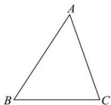
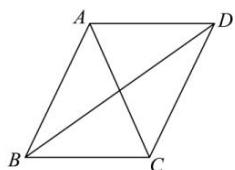

<!-- question-source:start -->
【16】（2023·辽宁高三统考期中）如图，已知 $\triangle ABC$ 三个内角 $A, B, C$ 的对边分别为 $a, b, c$ ，且 $b = \sqrt{2}, c = \sqrt{3}, a\cos C - c\sin A = b - \sqrt{2}c$ 。（1）求 $\tan A$ ；

(2) D 是 $\triangle ABC$ 外一点, 连接 AD, CD 构成平面四边形 ABCD, 若 $\angle ADC = \frac{\pi}{4}$ , 求 BD 的最大值.

<!-- question-source:end -->

![[Q00009660A1]]
