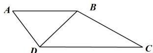

> [!faq]- 全练一本通解析
> **【答案】** （1） $\angle BCD=30^{\circ}$ ；（2） $3\sqrt{3}$
>
> **【解析】**
> （1）连接BD，在 $\triangle ABD$ 中，由正弦定理得 $\frac{BD}{\sin\angle BAD}=\frac{AD}{\sin\angle ABD}$ ，
> 在 $\triangle BCD$ 中，由正弦定理得 $\frac{BD}{\sin\angle BCD}=\frac{BC}{\sin\angle BDC}$ ，
> 因为 $\angle ABD=\angle BDC$ ，
> 所以 $\frac{\sin\angle BAD}{\sin\angle BCD}=\frac{BC}{AD}$ ，
> 又 $BC=\sqrt{3}AD,\angle BAD=2\angle BCD$ ，
> 所以 $\frac{\sin 2\angle BCD}{\sin\angle BCD}=\sqrt{3}$ ，化简得 $\cos\angle BCD=\frac{\sqrt{3}}{2}$ 。
> 因为 $0^{\circ}<\angle BCD<180^{\circ}$ ，所以 $\angle BCD=30^{\circ}$ 。
> （2）因为 $\angle BAD=2\angle BCD=60^{\circ},AB=AD=2$ 。
> 所以 $\triangle ABD$ 为等边三角形，且BD=2， $\angle DBC=180^{\circ}-60^{\circ}-30^{\circ}=90^{\circ}$ ，且 $CD=\sqrt{BD^{2}+BC^{2}}=\sqrt{2^{2}+(2\sqrt{3})^{2}}=4$ ，
> 又 $BC=\sqrt{3}AD=2\sqrt{3}$ 所以 $\triangle ABD$ 的面积为 $S_{\triangle ABD}=\frac{1}{2}AB\cdot AD\cdot\sin\angle BAD=\sqrt{3}$ ， $\triangle BCD$ 的面积为 $S_{\triangle BCD}=\frac{1}{2}BC\cdot DC\cdot\sin\angle BCD=2\sqrt{3}$ ，
> 所以梯形ABCD的面积为 $S=S_{A,BD}+S_{BCD}=3\sqrt{3}$ 。
> 
