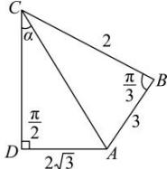

> [!faq]- 全练一本通解析
> **【答案】** （1） $AC=\sqrt{7}$ ; （2） $\tan\angle ACD=\frac{\sqrt{3}}{2}$
>
> **【解析】**
> （1）在△ABC中， $\angle ABC=\frac{\pi}{3}, BC=2$ 所以 $\overline{AB}\cdot\overline{CB}=\overline{BA}\cdot\overline{BC}=|\overline{BA}|\cdot|\overline{BC}|\cdot\cos\angle ABC=|\overline{BA}|\times2\times\frac{1}{2}=3$ 所以 AB=3，
> 在△ABC中，由余弦定理得 $AC^{2}=AB^{2}+BC^{2}-2AB\cdot BC\cos\angle ABC=3^{2}+2^{2}-2\times3\times2\times\frac{1}{2}=7$ 因为 AC>0，解得 $AC=\sqrt{7}$
> (2) 如图所示:
> 
> 设 $\angle ACD = \alpha$ ，则 $\angle ACB = \angle ACD + \frac{\pi}{3} = \alpha + \frac{\pi}{3}$ ，
> 在 Rt $\triangle ACD$ 中，因为 $AD = 2\sqrt{3}$ ，所以 $AC = \frac{AD}{\sin\alpha} = \frac{2\sqrt{3}}{\sin\alpha}$ ，
> 在 $\triangle ABC$ 中， $\angle BAC = \pi - \angle ACB - \angle ABC = \pi - \left(\alpha + \frac{\pi}{3}\right) - \frac{\pi}{3} = \frac{\pi}{3} - \alpha, \alpha \in \left(0, \frac{\pi}{3}\right)$ 由正弦定理，得 $\frac{BC}{\sin\angle BAC} = \frac{AC}{\sin\angle ABC}$ ，即 $\frac{2}{\sin\left(\frac{\pi}{3} - \alpha\right)} = \frac{\frac{2\sqrt{3}}{\sin\alpha}}{\frac{\sqrt{3}}{2}}$ ，所以 $2\sin\left(\frac{\pi}{3} - \alpha\right) = \sin\alpha$ ，即 $2\left(\frac{\sqrt{3}}{2}\cos\alpha - \frac{1}{2}\sin\alpha\right) = \sin\alpha$ ，
> 整理得 $\sqrt{3}\cos\alpha = 2\sin\alpha$ ，所以 $\tan\alpha = \frac{\sqrt{3}}{2}$ ，即 $\tan\angle ACD = \frac{\sqrt{3}}{2}$ 。
