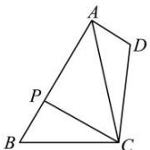

> [!faq]- 全练一本通解析
> **【答案】** （1） $\frac{\pi}{3}$ ；（2）2
>
> **【解析】**
> （1）设 $BC = CD = x > 0$ 在△ABC中由余弦定理得 $AC^2 = 9 + x^2 -2\times 3x\cos B = 7$ ，即 $x^{2} + 2 = 6x\cos B$ ①，
> 又在△ACD中由余弦定理得 $AC^2 = 1 + x^2 -2\times 1x\cos D = 7$ ，即 $x^{2} - 6 = 2x\cos D$ ②，
> 因为 $B + D = \pi$ ，则 $\cos D = \cos (\pi -B) = -\cos B$ 联立①②可得 $x = 2$ （负值舍去）， $\cos B = \frac{1}{2}$ ，因为 $B\in (0,\pi)$ ，所以 $B = \frac{\pi}{3}$ （2）在△PBC中，由正弦定理知， $\frac{BC}{\sin\angle BPC} = \frac{PC}{\sin B},$ 所以 $\sin \angle BPC = \frac{BC\sin B}{PC} = \frac{2\times\frac{\sqrt{3}}{2}}{\sqrt{3}} = 1,$ 又 $0 <   \angle BPC <   \pi$ ，故 $\angle BPC = \frac{\pi}{2}$ 在直角三角形△PBC中，由勾股定理知， $PB = \sqrt{BC^2 - PC^2} = 1$ 此时 $BA = AB,BB = 2$
> $$
> P A = A B - P B = 2
> $$
> 
