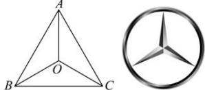

<!-- question-source:start -->
【16】（2022·河南安阳高一统考期末）已知 O 是 $\triangle ABC$ 内的一点，若 $\triangle BOC, \triangle AOC, \triangle AOB$ 的面积分别记为 $S_{1}, S_{2}, S_{3}$ ，则 $S_{1} \cdot \overrightarrow{OA} + S_{2} \cdot \overrightarrow{OB} + S_{3} \cdot \overrightarrow{OC} = \overrightarrow{0}$ 。这个定理对应的图形与“奔驰”轿车的 $\log o$ 相似，故形象地称为“奔驰定理”。如图，O 是 $\triangle ABC$ 的垂心，且 $\overrightarrow{OA} + 2\overrightarrow{OB} + 3\overrightarrow{OC} = \overrightarrow{0}$ ，则 $\tan \angle BAC : \tan \angle ABC : \tan \angle ACB = (\quad)$

A. $1:2:3$ B. $1:2:4$ C. $2:3:4$ D. $2:3:6$

第十节 专题:奔驰定理与三角形的面积【17】(2023·河北高三)(多选)奔驰定理:已知O是△ABC内一点,△BOC,△AOC,△AOB的面积分别为 $S_{A}$ , $S_{B}$ , $S_{C}$ ,则 $S_{A}\cdot\overrightarrow{OA}+S_{B}\cdot\overrightarrow{OB}+S_{C}\cdot\overrightarrow{OC}=\vec{0}$ . 设O是△ABC内一点,△ABC的三个内角分别为A,B,C,△BOC,△AOC,△AOB的面积分别为 $S_{A}$ , $S_{B}$ , $S_{C}$ ,若 $3\overrightarrow{OA}+4\overrightarrow{OB}+5\overrightarrow{OC}=\vec{0}$ ,则以下正确的有()

$$
S _ {A}: S _ {B}: S _ {C} = 3: 4: 5
$$

B. $O$ 有可能是 $\triangle ABC$ 的重心
C. 若 $O$ 为外心, 则 $\sin A: \sin B: \sin C = 3:4:5$ D. 若 $O$ 为内心, 则 $\triangle ABC$ 为直角三角形
<!-- question-source:end -->

![[Q00005222A1]]
