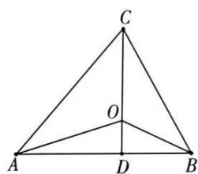

## 2. 奔驰定理与三角形四心关系

(1) O 是 $\triangle ABC$ 的重心

$$
\Leftrightarrow S _ {\triangle B O C}: S _ {\triangle C O A}: S _ {\triangle A O B} = 1: 1: 1 \Leftrightarrow \overrightarrow {O A} + \overrightarrow {O B} + \overrightarrow {O C} = \mathbf {0}.
$$

(2) O 是 $\triangle ABC$ 的内心

$$
\Leftrightarrow S _ {\triangle B O C}: S _ {\triangle C O A}: S _ {\triangle A O B} = a: b: c \Leftrightarrow a \cdot \overrightarrow {O A} + b \cdot \overrightarrow {O B} + c \cdot \overrightarrow {O C} = \mathbf {0}
$$

(3) O 是 $\triangle ABC$ 的外心

$$
\Leftrightarrow S _ {\triangle B O C}: S _ {\triangle C O A}: S _ {\triangle A O B} = \sin 2 A: \sin 2 B: \sin 2 C \Leftrightarrow \sin 2 A \cdot \overrightarrow {O A} + \sin 2 B \cdot \overrightarrow {O B} + \sin 2 C \cdot \overrightarrow {O C} = \mathbf {0}
$$

(4) O 是 $\triangle ABC$ 的垂心

$$
\Leftrightarrow S _ {\triangle B O C}: S _ {\triangle C O A}: S _ {\triangle A O B} = \tan A: \tan B: \tan C \Leftrightarrow \tan A \cdot \overrightarrow {O A} + \tan B \cdot \overrightarrow {O B} + \tan C \cdot \overrightarrow {O C} = 0
$$

关于（4）的证明如下.

【证明】如图, $O$ 为三角形的垂心, 因为 $\tan A = \frac{CD}{AD}, \tan B = \frac{CD}{DB} \Rightarrow$ $\Rightarrow \tan A: \tan B = DB: AD, S_{\triangle BOC}: S_{\triangle COA} = DB: AD$ , 所以 $S_{\triangle BOC}: S_{\triangle COA} = \tan A: \tan B$ . 同理得 $S_{\triangle COA}: S_{\triangle AOB} = \tan B: \tan C, S_{\triangle BOC}: S_{\triangle AOB} = \tan A: \tan C$ 所以 $S_{\triangle BOC}: S_{\triangle COA}: S_{\triangle AOB} = \tan A: \tan B: \tan C$ .

