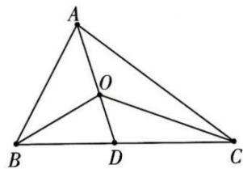

## 知识导学

1. 奔驰定理: 若点 O 是 $\triangle ABC$ 内一点, 则 $S_{\triangle BOC} \overrightarrow{OA} + S_{\triangle AOC} \overrightarrow{OB} + S_{\triangle AOB} \overrightarrow{OC} = 0$ .

【证明】 $\overrightarrow{AO} = \frac{AO}{AD}\overrightarrow{AD} = \frac{AO}{AD}\cdot \frac{DC}{BC}\overrightarrow{AB} +\frac{AO}{AD}\cdot \frac{BD}{BC}\overrightarrow{AC}$

$$
= \frac {S _ {\triangle A O C}}{S _ {\triangle A D C}} \cdot \frac {S _ {\triangle A D C}}{S _ {\triangle A B C}} (- \overrightarrow {O A} + \overrightarrow {O B}) + \frac {S _ {\triangle A O B}}{S _ {\triangle A D B}} \cdot \frac {S _ {\triangle A B D}}{S _ {\triangle A B C}} (- \overrightarrow {O A} + \overrightarrow {O C})
$$

得： $S_{\triangle BOC}\overrightarrow{OA}+S_{\triangle AOC}\overrightarrow{OB}+S_{\triangle AOB}\overrightarrow{OC}=\mathbf{0}$

推论：

已知 P 为 $\triangle ABC$ 所在平面一点，且满足 $m\overrightarrow{PA} + n\overrightarrow{PB} + p\overrightarrow{PC} = 0$ ，则 $S_{\triangle PBC}: S_{\triangle PCA}: S_{\triangle PAB} = |m|: |n|: |p|$ .

![[高中/课堂同步/题库/高中数学全练一本通/平面向量/第十节 专题_奔驰定理与面积问题/知识导学/2. 奔驰定理与三角形四心关系/2. 奔驰定理与三角形四心关系.md]]
