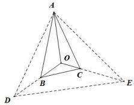

> [!faq]- 全练一本通解析
> **【答案】** 8
>
> **【解析】**
> 方法一: 根据根据奔驰定理, 易得面积之比为 $S_{\triangle AOB} = 8$ .
> 方法二: 如图所示, 延长 OB 到点 D, 使得 BD = OB, 延长 OC 到点 E, 使得 CE = 3OC,
> 连接 AD, DE, CE,
> ∵ O 为 △ABC 所在平面内一点, 且满足 $\overrightarrow{OA} + 2\overrightarrow{OB} + 4\overrightarrow{OC} = \vec{0}$ ,
> $\therefore \overrightarrow{OA} +\overrightarrow{OD} +\overrightarrow{OE} = \overrightarrow{0}$ 所以 $O$ 为 $\triangle ADE$ 的重心，
> 所以 $S_{\triangle AOB} = \frac{1}{2} S_{\triangle AOD},S_{\triangle AOC} = \frac{1}{4} S_{\triangle AOE},S_{\triangle COB} = \frac{1}{8} S_{\triangle EOD},$ 又 $S_{\triangle AOE} = S_{\triangle AOD} = S_{\triangle EOD}$ 所以 $S_{\triangle AOB}:S_{\triangle AOC}:S_{\triangle BOC} = \frac{1}{2}:\frac{1}{4}:\frac{1}{8} = 4:2:1$ ，又 $S_{\triangle ABC} = 14$ ，所以 $S_{\triangle AOB} = \frac{4}{4 + 2 + 1} S_{\triangle ABC} = \frac{4}{7}\times 14 = 8$ 故答案为：8
> 
