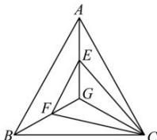

> [!faq]- 全练一本通解析
> **【答案】** $\frac{13}{18}$
>
> **【解析】**
> 方法一: 因为 $S_{\triangle AGB} = 7$ , $S_{\triangle CGB} = 5$ , $S_{\triangle AGC} = 6$ ,
> 所以 $S_{\triangle AGB}:S_{\triangle CGB}:S_{\triangle AGC}=7:5:6$ ∴由奔驰定理可得： $5\overrightarrow{GA}+6\overrightarrow{GB}+7\overrightarrow{GC}=\overrightarrow{0}$ 即 $5\overrightarrow{GA}+6(\overrightarrow{GA}+\overrightarrow{AB})+7(\overrightarrow{GA}+\overrightarrow{AC})=\overrightarrow{0}$ 整理可得： $18\overrightarrow{GA}+6\overrightarrow{AB}+7\overrightarrow{AC}=\overrightarrow{0}$ 即 $\overrightarrow{AG}=\frac{6}{18}\overrightarrow{AB}+\frac{7}{18}\overrightarrow{AC}=\frac{1}{3}\overrightarrow{AB}+\frac{7}{18}\overrightarrow{AC}$ 所以 $x=\frac{1}{3},y=\frac{7}{18}$ ，则 $x+y=\frac{1}{3}+\frac{7}{18}=\frac{13}{18}$ 故答案为： $\frac{13}{18}$ .
> 方法二: 在 GA 上取一点 E, 使得 $\overrightarrow{GE}=\frac{5}{7}\overrightarrow{GA}$ ,
> 在 GB 上取一点 E, 使得 $\overrightarrow{GF}=\frac{6}{7}\overrightarrow{GB}$ , 连接 GE, EF, FC,
> 
> 所以 $S_{\triangle EGF} = \frac{6}{7} \times \frac{5}{7} S_{\triangle AGB} = \frac{30}{7}$ ， $S_{\triangle CGE} = \frac{5}{7} S_{\triangle AGC} = \frac{30}{7}$ ， $S_{\triangle CGF} = \frac{6}{7} S_{\triangle CGB} = \frac{30}{7}$ ，
> 所以 G 为 $\triangle EFC$ 的重心，所以 $\overrightarrow{GE} + \overrightarrow{GF} + \overrightarrow{GC} = \overrightarrow{0}$ ，
> 也即 $\frac{5}{7}\overrightarrow{GA}+\frac{6}{7}\overrightarrow{GB}+\overrightarrow{GC}=\overrightarrow{0}$ ，所以 $5\overrightarrow{GA}+6\overrightarrow{GB}+7\overrightarrow{GC}=\overrightarrow{0}$ ，
> 即 $5\overrightarrow{GA}+6(\overrightarrow{GA}+\overrightarrow{AB})+7(\overrightarrow{GA}+\overrightarrow{AC})=\overrightarrow{0}$ 整理可得： $18\overrightarrow{GA}+6\overrightarrow{AB}+7\overrightarrow{AC}=\overrightarrow{0}$ 即 $\overrightarrow{AG}=\frac{6}{18}\overrightarrow{AB}+\frac{7}{18}\overrightarrow{AC}=\frac{1}{3}\overrightarrow{AB}+\frac{7}{18}\overrightarrow{AC}$ 所以 $x=\frac{1}{3},y=\frac{7}{18}$ ，则 $x+y=\frac{1}{3}+\frac{7}{18}=\frac{13}{18}$ ，故答案为： $\frac{13}{18}$ .
