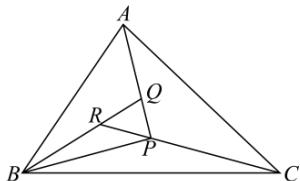

<!-- question-source:start -->
【11】（2022·全国高三专题练习）已知点 A, B, C, P 在同一平面内， $\overrightarrow{PQ} = \frac{1}{3}\overrightarrow{PA}$ ， $\overrightarrow{QR} = \frac{1}{3}\overrightarrow{QB}$ ， $\overrightarrow{RP} = \frac{1}{3}\overrightarrow{RC}$ ，则 $S_{\triangle ABC}: S_{\triangle PBC} =$ \_\_\_\_ .

<!-- question-source:end -->

![[Q00009558A1]]
