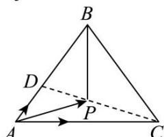

> [!faq]- 全练一本通解析
> **【答案】** $\frac{2}{5}$
>
> **【解析】**
> 方法一: 由 $\overrightarrow{AP}=\frac{1}{5}\overrightarrow{AB}+\frac{2}{5}\overrightarrow{AC}$ ，可得 $\overrightarrow{AP}=\frac{1}{5}\left(\overrightarrow{PB}-\overrightarrow{PA}\right)+\frac{2}{5}\left(\overrightarrow{PC}-\overrightarrow{PA}\right)$ ，整理得 $2\overrightarrow{PA}+\overrightarrow{PB}+2\overrightarrow{PC}=\overrightarrow{0}$ ，根据奔驰定理可得 $\Delta ABP$ 的面积与 $\Delta ABC$ 面积之比为 $\frac{2}{5}$ .
> 方法二：
> 
> 连接 CP 并延长交 AB 于 D,
> ∵P、C. D三点共线，∴ $\overrightarrow{AP} = \lambda \overrightarrow{AD} + \mu \overrightarrow{AC}$ ，且 $\lambda + \mu = 1$ ，设 $\overrightarrow{AB} = k \overrightarrow{AD}$ ，结合 $\overrightarrow{AP} = \frac{1}{5} \overrightarrow{AB} + \frac{2}{5} \overrightarrow{AC}$ ，得 $\overrightarrow{AP} = \frac{k}{5} \overrightarrow{AD} + \frac{2}{5} \overrightarrow{AC}$ ，由平面向量基本定理, 解之得 $\lambda=\frac{3}{5}$ , k=3 且 $\mu=\frac{2}{5}$ , $\therefore \overrightarrow{AP} = \frac{3}{5} \overrightarrow{AD} + \frac{2}{5} \overrightarrow{AC}$ 可得 $\overrightarrow{PD} = \frac{2}{5} \overrightarrow{CD}$ ,
> ∵ $\Delta ABP$ 与 $\Delta ABC$ 有相同的底边 AB，高的比等于 $\left|\overrightarrow{PD}\right|$ 与 $\left|\overrightarrow{CD}\right|$ 之比，
> ∴ $\Delta ABP$ 的面积与 $\Delta ABC$ 面积之比为 $\frac{2}{5}$ .
