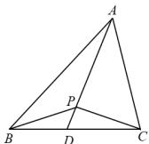

> [!faq]- 全练一本通解析
> **【答案】** $\frac{2}{3}$
>
> **【解析】**
> 方法一：由 $\overrightarrow{AP} = \frac{1}{2}\overrightarrow{AB} + \frac{1}{3}\overrightarrow{AC}$ ，可得 $\overrightarrow{AP} = \frac{1}{2}\left(\overrightarrow{PB} - \overrightarrow{PA}\right) + \frac{1}{3}\left(\overrightarrow{PC} - \overrightarrow{PA}\right)$ ，整理得 $2\overrightarrow{PC} + 3\overrightarrow{PB} + \overrightarrow{PA} = \vec{0}$ ，根据奔驰定理 $S_{\triangle ABP}\overline{PC} + S_{\triangle ACP}\overline{PB} + S_{\triangle BCP}\overline{PA} = \vec{0}$ ，可得 $\frac{S_{\triangle ABP}}{S_{\triangle ACP}} = \frac{2}{3}$ 。
> 方法二：如图，延长 $AP$ 交 $BC$ 于点 $D$ ，
> 设 $\overrightarrow{AD} = \lambda \overrightarrow{AP}$ ，则 $\overrightarrow{AD} = \frac{\lambda}{2}\overrightarrow{AB} + \frac{\lambda}{3}\overrightarrow{AC}$ ，因为 $B, C, D$ 共线，
> 所以 $\frac{\lambda}{2} + \frac{\lambda}{3} = 1$ ，解得 $\lambda = \frac{6}{5}$ ，
> 所以 $\overrightarrow{AP} = \frac{5}{6}\overrightarrow{AD}, \overrightarrow{AD} = \frac{3}{5}\overrightarrow{AB} + \frac{2}{5}\overrightarrow{AC}$ ，
> 则 $S_{\triangle ABP} = \frac{5}{6}S_{\triangle ABD}, S_{\triangle ACP} = \frac{5}{6}S_{\triangle ACD}$ ，
> 由 $\overrightarrow{AD} = \frac{3}{5}\overrightarrow{AB} + \frac{2}{5}\overrightarrow{AC}$ ，
> 得 $\frac{3}{5}\left(\overrightarrow{AD} - \overrightarrow{AB}\right) = \frac{2}{5}\left(\overrightarrow{AC} - \overrightarrow{AD}\right)$ ，即 $\frac{3}{5}\overrightarrow{BD} = \frac{2}{5}\overrightarrow{DC}$ ，
> 所以 $\frac{BD}{CD} = \frac{2}{3}$ ，所以 $\frac{S_{\triangle ABD}}{S_{\triangle ACD}} = \frac{2}{3}$ ，所以 $\frac{S_{\triangle ABP}}{S_{\triangle ACP}} = \frac{\frac{5}{6}S_{\triangle ABD}}{\frac{5}{6}S_{\triangle ACD}} = \frac{2}{3}$ 。
> 
