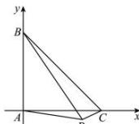

> [!faq]- 全练一本通解析
> **【答案】** $\frac{1}{3}$
>
> **【解析】**
> 方法一: 因为 $\overrightarrow{AP} = \frac{3}{4}\overrightarrow{BC} - \frac{2}{3}\overrightarrow{BA}$ ,
> 所以 $\overrightarrow{AP} = \frac{3}{4}\left(\overrightarrow{PC} - \overrightarrow{PB}\right) - \frac{2}{3}\left(\overrightarrow{PA} - \overrightarrow{PB}\right)$ ，整理得 $4\overrightarrow{PA} - \overrightarrow{PB} + 9\overrightarrow{PC} = \overrightarrow{0}$ 根据奔驰定理的推论 $4\overrightarrow{PA} - \overrightarrow{PB} + 9\overrightarrow{PC} = \overrightarrow{0}$ ,
> 则 $S_{\triangle PBC}: S_{\triangle PCA}: S_{\triangle PAB} = |4| : |-1| : |9|$ . 因为点 P 在三角形外部，根据图形可得 $S_{\triangle ABC} = S_{\triangle PAB} + S_{\triangle PBC} - S_{\triangle PAC} = 12$ ，所以 $\triangle PBC$ 与 $\triangle ABC$ 的面积比为 $\frac{4}{12} = \frac{1}{3}$ .
> 方法二: 假设 $\triangle ABC$ 是等腰直角三角形，且 A 是直角，AB = AC = 2，
> 建立如图所示平面直角坐标系，设 $P(x, y)$ ,
> 则 $B(0, 2), C(2, 0), \overrightarrow{BC} = (2, -2), \overrightarrow{BA} = (0, -2)$ ,
> 依题意 $\overrightarrow{AP} = \frac{3}{4}\overrightarrow{BC} - \frac{2}{3}\overrightarrow{BA}$ ,
> 即 $(x, y) = \frac{3}{4}(2, -2) - \frac{2}{3}(0, -2) = \left(\frac{3}{2}, -\frac{1}{6}\right)$ , $S_{\triangle ABC} = \frac{1}{2} \times 2 \times 2 = 2$ , $S_{\triangle PBC} = S_{\triangle PAC} + S_{\triangle ABC} - S_{\triangle PAB}$ $= \frac{1}{2} \times 2 \times \frac{1}{6} + \frac{1}{2} \times 2 \times 2 - \frac{1}{2} \times 2 \times \frac{3}{2} = \frac{1}{6} + 2 - \frac{3}{2} = \frac{2}{3}$ .
> 所以 $\triangle PBC$ 与 $\triangle ABC$ 的面积比为 $\frac{2}{3} = \frac{1}{3}$ .
> 
> 解析: 方法一: 因为 $\overrightarrow{PA} + \overrightarrow{PB} + 2\overrightarrow{PC} = 3\overrightarrow{AB}$ ，所以 $\overrightarrow{PA}+\overrightarrow{PB}+2\overrightarrow{PC}=3\overrightarrow{AP}+3\overrightarrow{PB},\therefore4\overrightarrow{PA}-2\overrightarrow{PB}+2\overrightarrow{PC}=\vec{0}$ ，根据奔驰定理的推论 $4\overrightarrow{PA}-2\overrightarrow{PB}+2\overrightarrow{PC}=\vec{0}$ ，则 $S_{\triangle PBC}:S_{\triangle PCA}:S_{\triangle PAB}=\left|4\right|:\left|-2\right|:\left|2\right|$ 。因为点 P 在三角形外部，根据图形可得 $S_{\triangle ABC}=S_{\triangle PAB}+S_{\triangle PBC}-S_{\triangle PAC}=4$ ，所以 $\Delta ABP$ 与 $\Delta ABC$ 的面积之比 $\frac{S_{\Delta ABP}}{S_{\Delta ABC}}=\frac{2}{4}=\frac{1}{2}$ .
> 方法二: 因为 $\overrightarrow{PA} + \overrightarrow{PB} + 2\overrightarrow{PC} = 3\overrightarrow{AB}$ 所以 $\overrightarrow{PA} + \overrightarrow{PB} + 2\overrightarrow{PC} = 3\overrightarrow{AP} + 3\overrightarrow{PB}, \therefore 4\overrightarrow{PA} - 2\overrightarrow{PB} + 2\overrightarrow{PC} = 0$
> $\therefore 2\overline{PA} - \overline{PB} + \overline{PC} = 0, \therefore 2\overline{PA} = \overline{PB} - \overline{PC} = \overline{CB}$ 所以 $PA||CB, \overline{PA} = \frac{1}{2}\overline{CB}$ ，所以 $\Delta ABP$ 与 $\Delta ABC$ 的面积之比 $= \frac{S_{\Delta ABP}}{S_{\Delta ABC}} = \frac{\frac{1}{2} \cdot AB \cdot AP \cdot \sin \angle BAP}{\frac{1}{2} \cdot AB \cdot BC \cdot \sin (\pi - \angle BAP)} = \frac{1}{2}$ . 故答案为1:2
