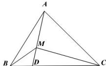

> [!faq]- 全练一本通解析
> **【答案】** 详见解析
>
> **【解析】**
> 1:2
> 
> 设 $S_{\triangle MDB} = S$ ，所以 $S_{\triangle MDC} = 3S, S_{\triangle MCB} = 4S$ ，由 $\overrightarrow{AM} = \frac{2}{3}\overrightarrow{AD} \Rightarrow \overrightarrow{AM} = \frac{2}{3}\left(\overrightarrow{AM} + \overrightarrow{MD}\right) \Rightarrow \overrightarrow{AM} = 2\overrightarrow{MD}$ ，则 $S_{\triangle MAB} = 2S, S_{\triangle DAB} = 3S$ ，再由 $\overrightarrow{BD} = 3\overrightarrow{DC}$ 可得 $S_{\triangle DAC} = 9S$ ，所以 $S_{\triangle MAC} = 9S - 3S = 6S$ 。于是 $S_{\triangle MAB}: S_{\triangle MCB}: S_{\triangle MAC} = 2S: 4S: 6S = 1: 2: 3$ 。
