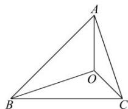

<!-- question-source:start -->
【16】（2022·河南安阳高一统考期末）已知 O 是 $\triangle ABC$ 内的一点，若 $\triangle BOC, \triangle AOC, \triangle AOB$ 的面积分别记为 $S_{1}, S_{2}, S_{3}$ ，则 $S_{1} \cdot \overrightarrow{OA} + S_{2} \cdot \overrightarrow{OB} + S_{3} \cdot \overrightarrow{OC} = \overrightarrow{0}$ 。这个定理对应的图形与“奔驰”轿车的 $\log o$ 相似，故形象地称为“奔驰定理”。如图，O 是 $\triangle ABC$ 的垂心，且 $\overrightarrow{OA} + 2\overrightarrow{OB} + 3\overrightarrow{OC} = \overrightarrow{0}$ ，则 $\tan \angle BAC : \tan \angle ABC : \tan \angle ACB = (\quad)$

A. $1:2:3$ B. $1:2:4$ C. $2:3:4$ D. $2:3:6$

第十节 专题:奔驰定理与三角形的面积
<!-- question-source:end -->

![[Q00009563A1]]
