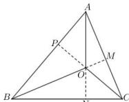

> [!faq]- 全练一本通解析
> **【答案】** A
>
> **【解析】**
> 解析: 方法一: 根据奔驰定理与三角形四心的关系, 可得到结论.
> 方法二: O 是 $\triangle ABC$ 的垂心, 延长 CO, BO, AO 分别交边 AB, AC, BC 于点 P, M, N, 如图,
> 则 $CP \perp AB, BM \perp AC, AN \perp BC$ , $\angle BOP = \angle BAC, \angle AOP = \angle ABC$ ,
> 
> 因此， $\frac{S_{1}}{S_{2}}=\frac{BP}{AP}=\frac{OP\tan\angle BOP}{OP\tan\angle AOP}=\frac{\tan\angle BAC}{\tan\angle ABC}$ ，同理 $\frac{S_{1}}{S_{3}}=\frac{\tan\angle BAC}{\tan\angle ACB}$ ，
> 于是得 $\tan\angle BAC:\tan\angle ABC:\tan\angle ACB=S_{1}:S_{2}:S_{3}$ 又 $\overrightarrow{OA}+2\overrightarrow{OB}+3\overrightarrow{OC}=\vec{0}$ ，即 $\overrightarrow{OC}=-\frac{1}{3}\overrightarrow{OA}-\frac{2}{3}\overrightarrow{OB}$ ，由“奔驰定理”有 $S_{1}\cdot\overrightarrow{OA}+S_{2}\cdot\overrightarrow{OB}+S_{3}\cdot\overrightarrow{OC}=\vec{0}$ 则 $\overrightarrow{OC}=-\frac{S_{1}}{S_{3}}\cdot\overrightarrow{OA}-\frac{S_{2}}{S_{3}}\cdot\overrightarrow{OB}$ ，而 $\overrightarrow{OA}$ 与 $\overrightarrow{OB}$ 不共线，有 $\frac{S_{1}}{S_{3}}=\frac{1}{3}$ ， $\frac{S_{2}}{S_{3}}=\frac{2}{3}$ ，即 $S_{1}:S_{2}:S_{3}=1:2:3$ ，所以 $\tan\angle BAC:\tan\angle ABC:\tan\angle ACB=1:2:3$ 。
>
> 故选 **A**
