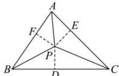

> [!faq]- 全练一本通解析
> **【答案】** B
>
> **【解析】**
> 内
> 解析：方法一：根据正弦定理可得， $\sin\angle BAC:\sin\angle ABC:\sin\angle ACB=a:b:c$ 所以 $a\cdot\overrightarrow{PA}+b\cdot\overrightarrow{PB}+c\cdot\overrightarrow{PC}=\vec{0}$ ，根据奔驰定理与三角形四心的关系，可以得到 P 是 $\triangle ABC$ 的内心。
> 方法二：过点 P 分别作 BC，CA，AB 的垂线 PD，PE，PF，其垂足依次为 D, E, F，如图所示，
> 由于 $\sin\angle BAC\cdot\overrightarrow{PA}+\sin\angle ABC\cdot\overrightarrow{PB}+\sin\angle ACB\cdot\overrightarrow{PC}=\vec{0}$
> 根据奔驰定理就有： $S_{\triangle BPC}:S_{\triangle CPA}:S_{\triangle APB}=\sin\angle BAC:\sin\angle ABC:\sin\angle ACB=BC:AC:AB$ 即 $\left(\frac{1}{2}BC\times PD\right):\left(\frac{1}{2}AC\times PE\right):\left(\frac{1}{2}AB\times PF\right)=BC:AC:AB$ 因此 PD = PE = PF ，故点 P 是 $\triangle ABC$ 的内心，B 选项正确。故选：B
> 
