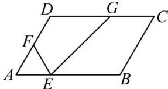

<!-- question-source:start -->
【67】（2023·重庆北碚高一校考）如图，在平行四边形ABCD中， $\left|\overrightarrow{AB}\right|=3,\left|\overrightarrow{AD}\right|=2,\angle DAB=60^{\circ}$ ，点E，F，G分别在边AB，AD，DC上，且 $\overrightarrow{AE}=\frac{1}{3}\overrightarrow{AB}$ ， $\overrightarrow{AF}=\overrightarrow{FD}$ ， $\overrightarrow{DG}=\lambda\overrightarrow{DC}(0\leq\lambda\leq1)$ 。
（1）若 $\lambda=\frac{1}{2}$ ，用 $\overrightarrow{AB}$ ， $\overrightarrow{AD}$ 表示 $\overrightarrow{EG}$ ；
（2）求 $\overrightarrow{EG} \cdot \overrightarrow{EF}$ 的取值范围.

<!-- question-source:end -->

![[Q00004937A1]]
