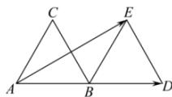

<!-- question-source:start -->
【10】如图, $\triangle ABC$ , $\triangle BDE$ 都是边长为 1 的等边三角形, $A$ , $B$ , $D$ 三点共线, 则 $\overrightarrow{AD} \cdot \overrightarrow{AE} = \underline{\quad}$ .

<!-- question-source:end -->

![[Q00009216A1]]
